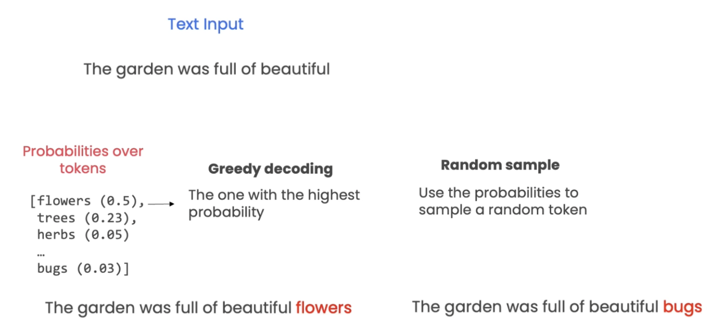

# Daily Knowledge

## Day 1

### RAG

- RAG: augmenting LLM knowledge with additional data
  - Indexing:
    - Load (the data in internet),
    - Standardise in a same format (langchain called as document),
    - Split into chunks
    - Embeded using Embedding models
    - Store in vector database
  - Retrieval & Generation
    - Retrival: select the relevant data with your questions
    - Generation: generate the prompt wih the relevant data + LLM -> answer

#### RAG's Current Limitations

- A model can take a long context doesn’t mean that it can efficiently leverage all the information. Reranking is needed.
- Today, most RAG systems are still text-based, but we’re seeing exciting work on RAG for tabular data and multimodal data. There are also discussions on new techniques for RAG such as RAFT (RAFT: Adapting Language Model to Domain Specific RAG) which combines finetuning and RAG.
- RAG Evaluation: very challenging as we need to evaluate not only the system end-to-end but also different components of the system, such as the embedding quality and retrieval quality.
- RAG Scalability - how to make RAG work with a lot of data (such as millions of text chunks or 200K of lines of code): you might need to filter out data by metadata before doing semantic search for retrieval.

### LLM Model Landscape

- Close-source (input/output per MTokens): OpenAI (GPT4-turbo) 128K, Ahthropic (Claude 3 Opus) 200K, Google (Gemimi 1.5 Pro, VertexAI): 1M tokens context window,
- Open-source (free): Meta (Llama 3) 128K

### Parameter Efficient Fine-tuning (PEFT)

- Parameter Efficient Fine-tuning (PEFT) - freeze all of the weigths & augment a base model with a relatively small number of trainable parameters.
  - PEFT encapsulates a family of techniques, one of which is the popular LoRA (Low-Rank Adaptation) method

#### LORA

- The basic idea behind LoRA is to pick a subset of layers in an existing model and modify their weights as follows:
- **Original hidden layer** of a model: $h(x) = W_0*x$, where
  - $h()$ = the hidden layer that will be tuned
  - $W_0$ = the original weight matrix for the h with dimension $(d, k)$
    - For example, $d=1000$, $k=1000$, so $W_0$ will have 1M trainable parameters
  - $x$ = the input to the hidden layer
- **LORA** will add $\Delta W$ (a matrix of trainable parameters) into the current hidden layer:
  $$ H(x) = W_0*x + \Delta W * x$$

- $\Delta W$ is decomposed according to $\Delta W=BA$ , where
  - $\Delta W$ is a $(d, k)$ matrix,
  - $B$ is $(d, r)$
  - $A$ is $(r, k)$
  - $r$ is the assumed “intrinsic rank” of $\Delta W$, which can be as small as 1 or 2
- **Key Point** $r$: if $d=1000$, $r=2$, and $k=1000$, so the number of trainable parameters drops from $1M$ to $1000*2 + 2*1000 = 4000$ in that layer

- **API rate limit**: Most API services have rate limits, so if the code was not designed to wait in-between API calls, you may not receive embeddings for all batches of text.
  - This particular service can handle 20 calls per minute. In calls per second, that's 20 calls divided by 60 seconds, or `20/60`

## LLM Models

### Bison

- `text-bison@001` use for instant response instead of multi-turn dialouge
- `chat-bison@001`. (chat-bison model, version 1) use for multi-turn dialogue

## Adjusting Creativity/Randomness

- You can control the behavior of the language model's _decoding strategy_ by adjusting the **temperature**, **top-k**, and **top-n** parameters.
- _Decoding strategy_ is to determine the next words in LLM
  - Greedy decoding: select the one with highest probability, in this example is flower (0.5)
  - Random sample: use the probabilies to sample a random token, say bugs (0.03)
  

- The decoding strategy applies `top_k`, then `top_p`, then `temperature` (in that order).
  - Step 1: Tokens will be filter by `top_k`
  - Step 2: Further filter by `top_p`
  - Step 3: Output will be selected based on the temperature
  

### Temperature

- `temperature` [0 to 1.0] controls the randomness

  - **Low temp:** used for the deterministic or less open-end responses say classification or extraction tasks
  - **High temp:** used for more randomness, namely open-end tasks like brainstorming or summarisation
  

- Formula for temperature
  

### Top K

- Sample from tokens with the `top_k` probabilities
- The default value for `top_k` is `40`.
- You can set `top_k` to values between `1` and `40`.

### Top P

- Top p: sample the minimum set of tokens whose probabilities add up to probability `p` or greater.
- The default value for `top_p` is `0.95`.
- If you want to adjust `top_p` and `top_k` and see different results, remember to set `temperature` to be greater than zero, otherwise the model will always choose the token with the highest probability.
  

