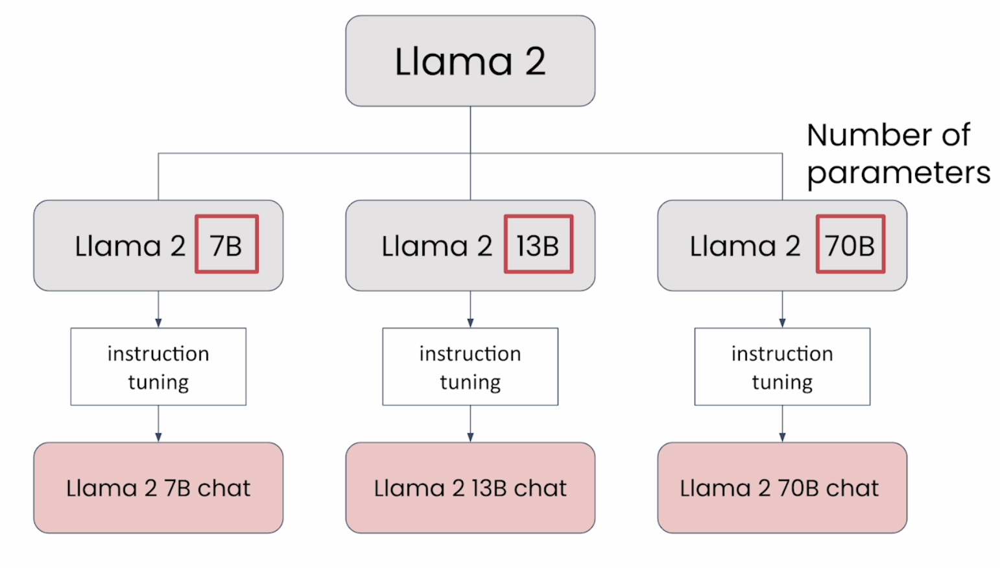
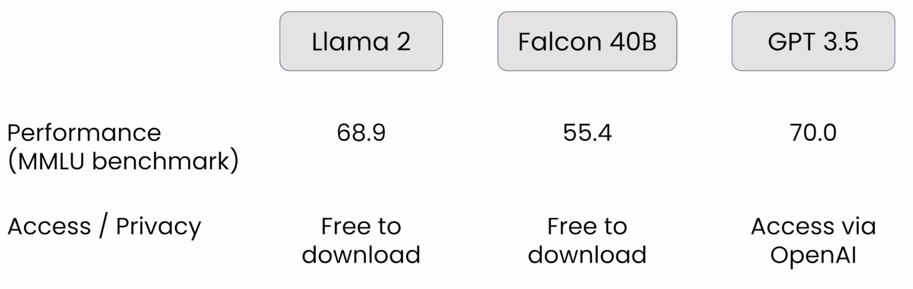
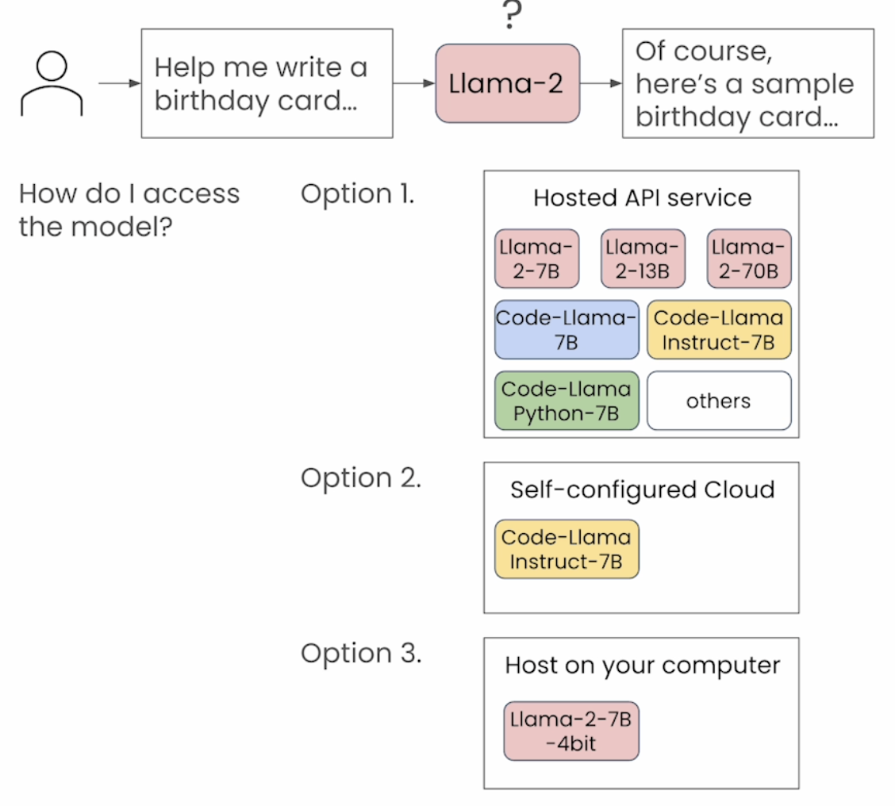
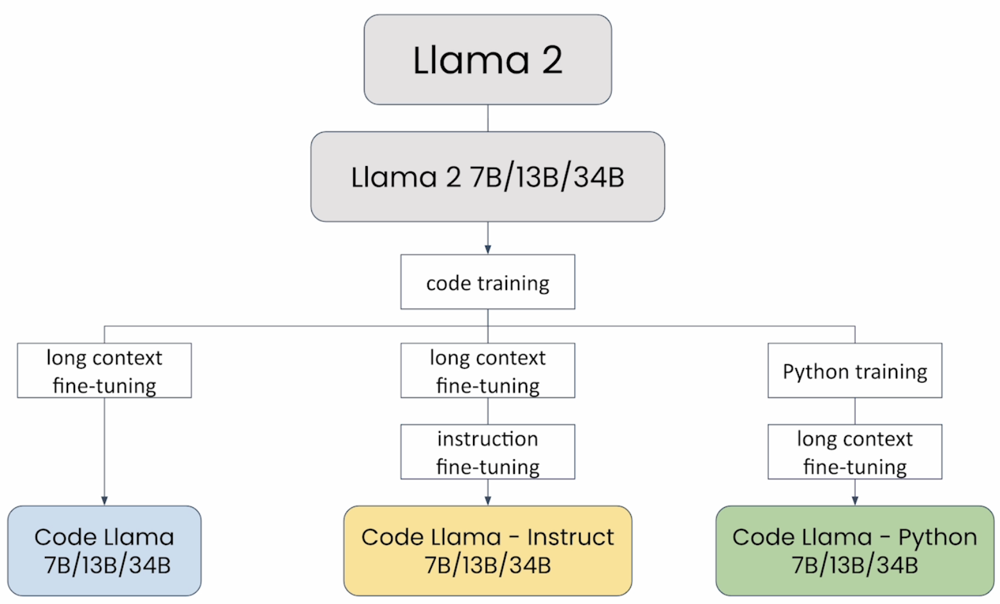

# Llama Introduction

## Llama 2

### How to access Llama models

- There are couple of methods to access the Llama models
  - Hosting API service: Amazon Bedrock, AnyScale, Google Cloud, Microsoft Azure, Replicate, Together.ai, etc
  - Self-configured Cloud: such as self-own hosting in Amazon Sagemaker
  - Local PC

### Code Llama

- **Code Llama** is a family of large language models for code based on Llama 2 providing state-of-the-art performance among open models, infilling capabilities, support for large input contexts, and zero-shot instruction following ability for programming tasks.
- Code Llama cover a wide range of applications:
  - Foundation model (Code Llama)
  - Python specialization model (Code Llama - Python)
  - Instruction-following model (Code Llama - Instruct) which is fine-tuned for understanding natural language instructions.

