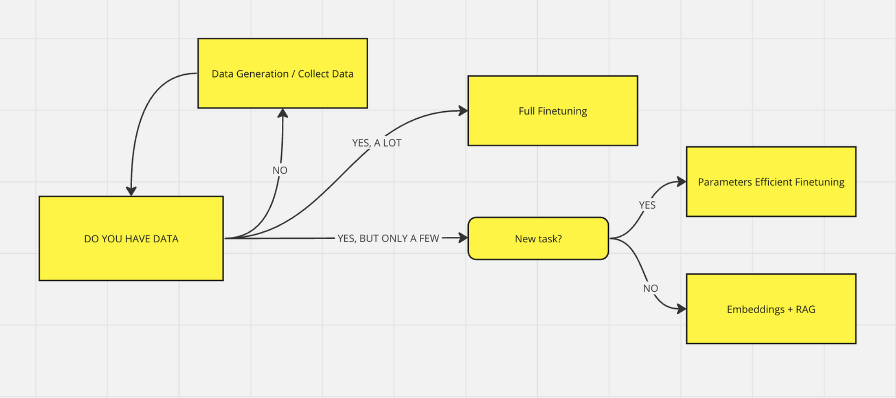
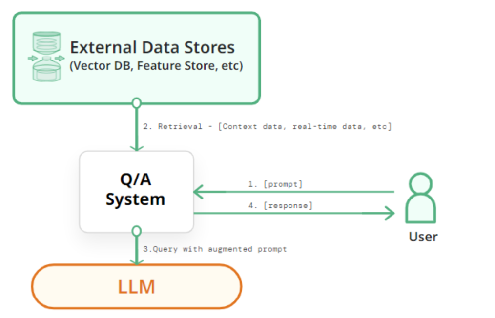

# LLM Training

- Data: Data Preparation, Data Generation
- Libraries & Computation: Fine-tune, Embedding & GPU Estimation

## LLM Models

- Open-source: LLAMA-2, Claude, PaLM

## Fine-tuning

### Why fine-tuning LLMs ?

- Pre-trained models are powerfull but
  - Good generalist, but Bad specialisation
  - Need Knowledge-base to be able to perform well in a new task
- Finetuning:
  - Cheap and efficient
  - Adapt pre-trained models to the real world

### Design a efficient fine-tuning pipeline

#### Data Generation

- Example: Orca (Microsoft paper - use the result from GPT4 and then distillated to a smaller model, open-source Orca), Phi-1.5 (1.5B parameters), Evol-Intruct
- LLM prompts consists of
  - SYS Instruction (Optional): define the characteristics of the chatbot/assistant
  - Input: the question that the user asks
  - Output: the answer that the assistant will response given the input
- There are two common formats in organizing LLM finetuning data:
  - ShareGPT - most common
  - Alpaca (prompt will be fixed)

#### Fine-tuning

- **Axolotl** is the leading open-source library for training/fine-tuning LLM
  - Offers a lot of optimization and pipelines to speed up the fine-tuning process: Microsoft DeepSpeed (save GPU, and optimize data transfers between GPUs), Parameter-Efficient Fine-Tuning (PEFT), Flash Attention 2 (an optimisation on Hardware for doing Attention), WanDB
  - Support a variaty of dataset formats (**JSONL recommended**)
    - `alpaca` instruction; input (optional)
    - `share_gpt` conversations where `from` is `human / gpt`
    - `completion` raw corpus
- Hugging Face 's Transformer Reinforcement Learning (TRL): train another model to mark the results of the LLM

## Embeddings

- Fine-tuning is not the only choice and not even best solution
- Rule of Thumb: if you do not have a lot of data (i.e less than 1M samples) + Task is QA on a specific source (PDF, text, or anything can be turned into text)
  - **RAG Embedding** is the best choice

### Retrieval Augmented Generation (RAG)

- RAG is the processing of **adding more knowledge** to the model’s (knowledge-base) by leveraging search _indexing_ and _in-context_ learning (prompt engineering)

#### Why RAG rather than GPT ?

- GPT does not have the knowledge with the outside data

## Serving

### Hugging Face

- HuggingFace is the largest open-source AI organization in the world.

### LLAMA.CPP

- If GPU is the constrain, **LLaMA.cpp** is an excellent backend if you need fast CPU inference.
