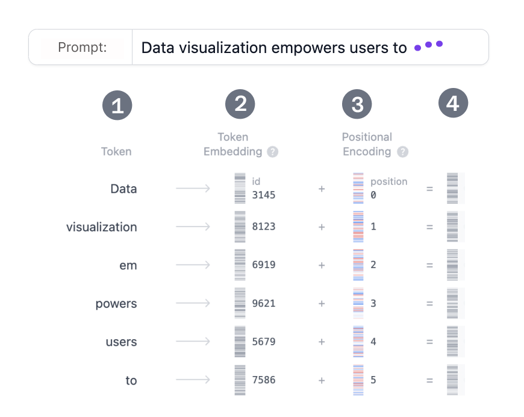
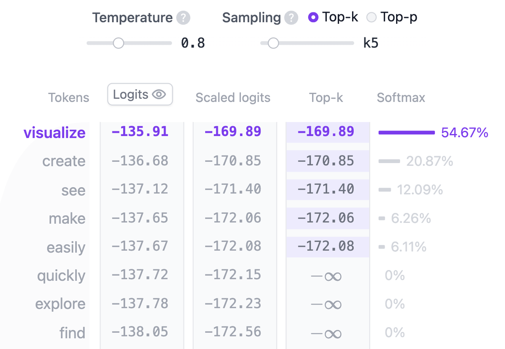

# Transformer-Based Models

## Transformer Explainer

- Every text-generative Transformer consists of these 3 key components:
  - **Embedding**: Text input is divided into smaller units called tokens, which can be words or subwords. These tokens are converted into numerical vectors called embeddings, which capture the semantic meaning of words.
  - **Transformer Block** is the fundamental building block of the model that processes and transforms the input data. Each block includes:
    - **Attention Mechanism**, the core component of the Transformer block. It allows tokens to communicate with other tokens, capturing contextual information and relationships between words.
    - **MLP (Multilayer Perceptron) Layer**, a feed-forward network that operates on each token independently. While the goal of the attention layer is to route information between tokens, the goal of the MLP is to refine each token's representation.
  - **Output Probabilities**: The final linear and softmax layers transform the processed embeddings into probabilities, enabling the model to make predictions about the next token in a sequence.

### Embedding

- Let's say you want to generate text using a Transformer model. You add the prompt like this one: “Data visualization empowers users to”
- To convert a prompt into embedding, we need to
  1. tokenize the input
  2. obtain token embeddings
  3. add positional information, and finally
  4. add up token and position encodings to get the final embedding.
  

### Transformer Blocks

- Refer: [Transformer Explainer](https://poloclub.github.io/transformer-explainer/)

### Output Probabilities

- After the input has been processed through all Transformer blocks, the output is passed through the final linear layer to prepare it for token prediction.
- This layer projects for every token in the vocabulary a corresponding value called `logits`.
- Logits are simply divided by the `temperature` to get the `scaled_logits`:
  - $temperature = 1$: Dividing logits by one has no effect on the softmax outputs.
  - $temperature < 1$: Lower temperature makes the model more confident and deterministic by sharpening the probability distribution, leading to more predictable outputs.
  - $temperature > 1$: Higher temperature creates a softer probability distribution, allowing for more randomness in the generated text – what some refer to as model “creativity”.
- In addition, the sampling process can be further refined using `top-k` and `top-p` parameters:
  - **top-k sampling**: Limits the candidate tokens to the top k tokens with the highest probabilities, filtering out less likely options.
  - **top-p sampling**: Considers the smallest set of tokens whose cumulative probability exceeds a threshold p, ensuring that only the most likely tokens contribute while still allowing for diversity.

## Encoder-Decoder Model

### Encoder Model

-
