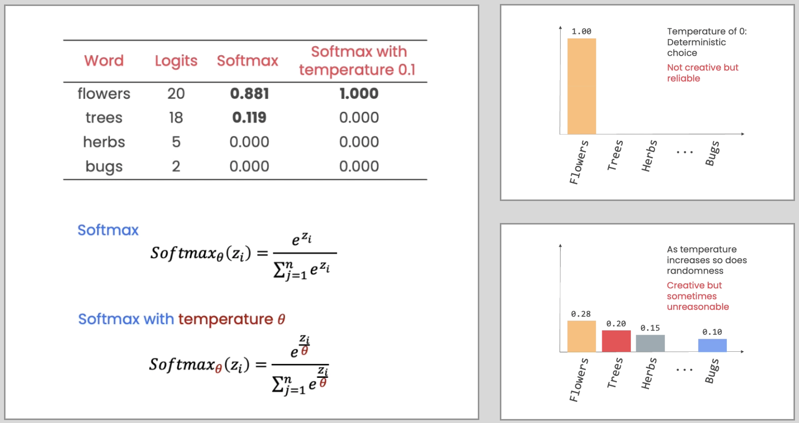
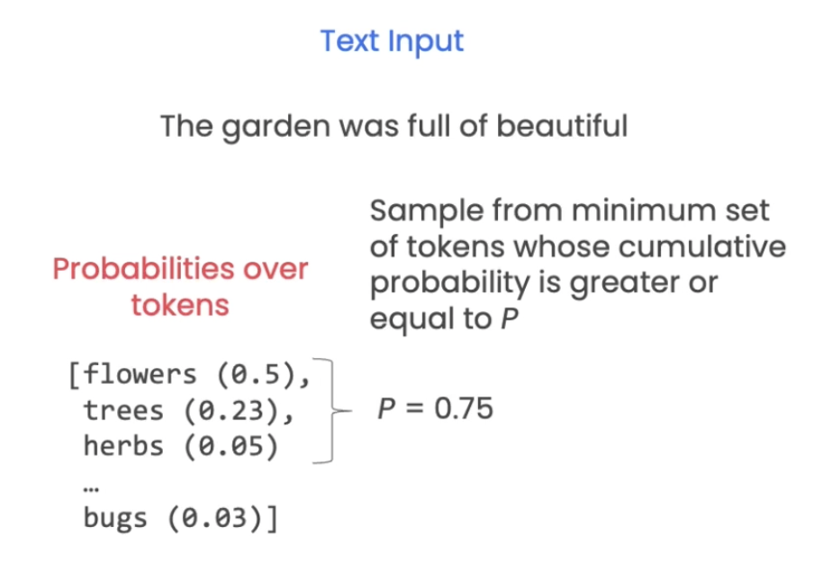

# Vertex AI

## Text Embeddings

### What is Text Embedding

#### How are sentence embeddings computed ?

- Simple Method: embedded each word separately &#8594; take sum or mean of all word embeddings
  - Drawback: lose the word position/context, say 2 sentneces have the same words, but those words which are placed differently will make the sentence's meaning different from each other. However, the sentence embedding vector will be the same as we will take the sum or mean of those words only.
- Modern Method:
  - Use transformer neural network to compute a context-aware representation of each word, then take average the context-aware representations
  - Compute embeddings for each token (e.g. sub-word) rather than words, which enables the algorithm to work even with novel or mispelt word

#### Text Embedding Application

Refer [notebook](../notebooks/vertex-ai-applications-of-embeddings.ipynb)

- Classification
- Clustering
- Outlier Detection
- Semantic Search
- Recommendation

### Text Embeddings with Vertex AI

- If you were running this notebook locally, you would first install Vertex AI.

```Python
!pip install google-cloud-aiplatform
```

- Setup Google Cloud

```Python
# Import and initialize the Vertex AI Python SDK

import vertexai

REGION = 'us-central1'

vertexai.init(project = PROJECT_ID,
              location = REGION,
              credentials = credentials)
```

- Load the embedding model and get word embeddings

```Python
from vertexai.language_models import TextEmbeddingModel

embedding_model = TextEmbeddingModel.from_pretrained(
    "textembedding-gecko@001")

# Generate a word embedding
embedding = embedding_model.get_embeddings(
    ["life"])

vector = embedding[0].values
print(f"Length = {len(vector)}")
print(vector[:10])
"""
Length = 768
[-0.006005102302879095, 0.015532972291111946, -0.030447669327259064, 0.05322219058871269, 0.014444807544350624, -0.0542873740196228, 0.045140113681554794, 0.02127358317375183, -0.06537645310163498, 0.019103270024061203]
"""
```

- Generate a sentence embedding.

```Python
embedding = embedding_model.get_embeddings(
    ["What is the meaning of life?"])
vector = embedding[0].values
print(f"Length = {len(vector)}") #Length = 768
```

## Large Language Model

```Python
import vertexai
vertexai.init(project=PROJECT_ID,
              location=REGION,
              credentials = credentials)

from vertexai.language_models import TextGenerationModel

# text-bison@001 use for instant response instead of multi-turn dialouge
generation_model = TextGenerationModel.from_pretrained(
    "text-bison@001")
```

### Question Answering

- You can ask an open-ended question to the language model.

```Python
prompt = "I'm a high school student. \
Recommend me a programming activity to improve my skills."

print(generation_model.predict(prompt=prompt).text)
```

### Classify and elaborate

- For more predictability of the language model's response, you can also ask the language model to choose among a list of answers and then elaborate on its answer.

```Python
prompt = """I'm a high school student. \
Which of these activities do you suggest and why:
a) learn Python
b) learn Javascript
c) learn Fortran
"""

```

### Extract information and format it as a table

```Python
prompt = """ A bright and promising wildlife biologist \
named Jesse Plank (Amara Patel) is determined to make her \
mark on the world.
Jesse moves to Texas for what she believes is her dream job,
only to discover a dark secret that will make \
her question everything.
In the new lab she quickly befriends the outgoing \
lab tech named Maya Jones (Chloe Nguyen),
and the lab director Sam Porter (Fredrik Johansson).
Together the trio work long hours on their research \
in a hope to change the world for good.
Along the way they meet the comical \
Brenna Ode (Eleanor Garcia) who is a marketing lead \
at the research institute,
and marine biologist Siri Teller (Freya Johansson).

Extract the characters, their jobs \
and the actors who played them from the above message as a table
"""

response = generation_model.predict(prompt=prompt)

print(response.text)
```

| Character   | Job                | Actor             |
| ----------- | ------------------ | ----------------- |
| Jesse Plank | Wildlife Biologist | Amara Patel       |
| Maya Jones  | Lab Tech           | Chloe Nguyen      |
| Sam Porter  | Lab Director       | Fredrik Johansson |
| Brenna Ode  | Marketing Lead     | Eleanor Garcia    |
| Siri Teller | Marine Biologist   | Freya Johansson   |

### Adjusting Creativity/Randomness

- You can control the behavior of the language model's _decoding strategy_ by adjusting the **temperature**, **top-k**, and **top-n** parameters.

```Python
response = generation_model.predict(
    prompt=prompt,
    temperature=0.9,
    top_k=top_k,
    top_p=top_p,
)
```

- _Decoding strategy_ is to determine the next words in LLM
  - Greedy decoding: select the one with highest probability, in this example is flower (0.5)
  - Random sample: use the probabilies to sample a random token, say bugs (0.03)
  <p align="center"></p>
- The decoding strategy applies `top_k`, then `top_p`, then `temperature` (in that order).
  - Step 1: Tokens will be filter by `top_k`
  - Step 2: Further filter by `top_p`
  - Step 3: Output will be selected based on the temperature
  <p align="center"></p>

#### Temperature

- `temperature` [0 to 1.0] controls the randomness

  - **Low temp:** used for the deterministic or less open-end responses (such as classification or information extraction), set temperature to zero.
  - **High temp:** used for more randomness, namely open-end tasks like brainstorming or summarisation
  <p align="center"></p>

- Formula for temperature
  <p align="center"></p>

#### Top K

- Sample from tokens with the `top_k` probabilities
- The default value for `top_k` is `40`.
- You can set `top_k` to values between `1` and `40`.

#### Top P

- Top p: sample the minimum set of tokens whose probabilities add up to probability `p` or greater.
- The default value for `top_p` is `0.95`.
- If you want to adjust `top_p` and `top_k` and see different results, remember to set `temperature` to be greater than zero, otherwise the model will always choose the token with the highest probability.
  <p align="center"></p>
